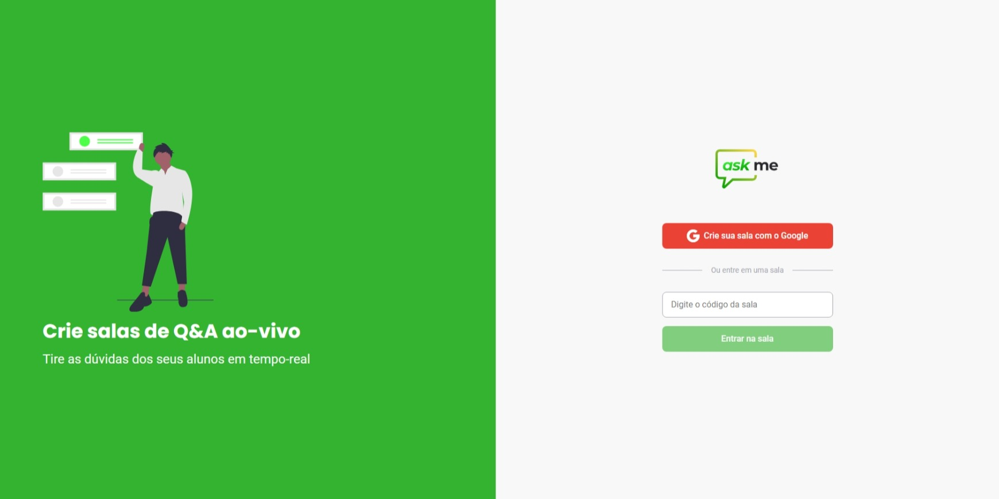

<p align="center">
  
</p>
<hr>



<hr>
<br>

# 🧪 Tecnologias
Esse projeto foi desenvolvido com as seguintes tecnologias:

- React
- Styled Componentes
- Firebase
- TypeScript

# 🚀 Como executar
Clone o projeto e acesse a pasta do mesmo.

```
$ git clone https://github.com/Jonatan966/askme
$ cd askme
```
Para iniciá-lo, siga os passos abaixo:
```
# Instalar as dependências
$ yarn

# Iniciar o projeto
$ yarn start
```
O app estará disponível no seu browser pelo endereço http://localhost:3000.

Lembrando que será necessário criar uma conta no Firebase e um projeto para disponibilizar um Realtime Database.

# 💻 Projeto
O Askme é perfeito para professores(as) poderem criar salas de Q&A com seus alunos, de forma muito organizada e democrática.

# 📝 License
Esse projeto está sob a licença MIT. Veja o arquivo [LICENSE](LICENSE.md) para mais detalhes.