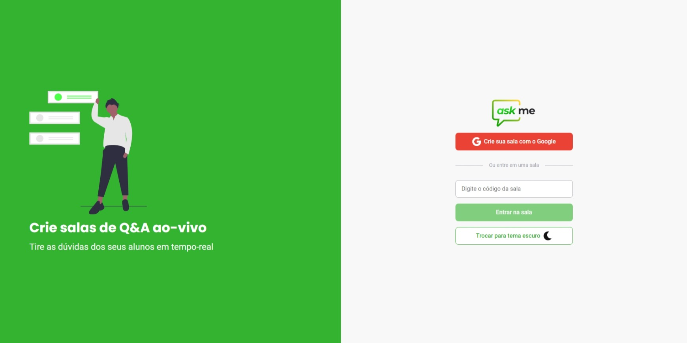
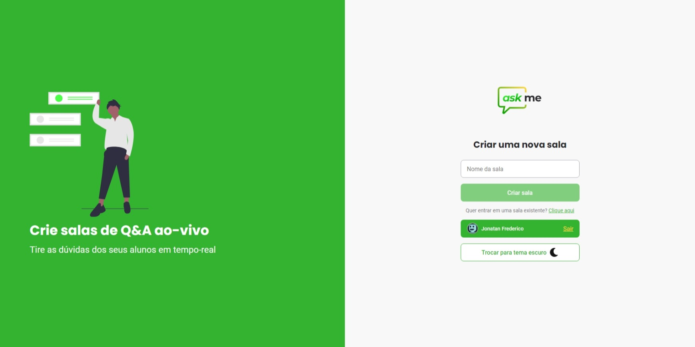
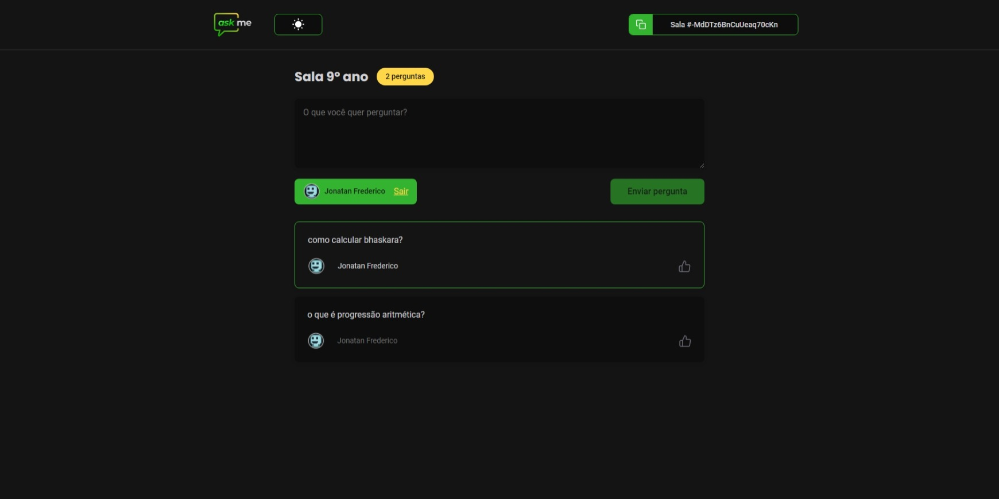
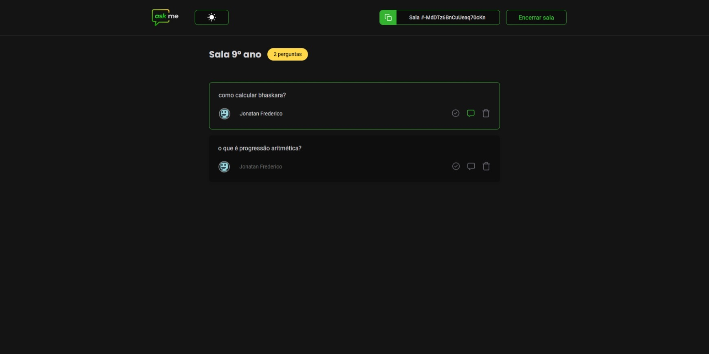

<p align="center">
  
</p>
<hr>

## 💻 Projeto
O Askme é perfeito para professores(as) poderem criar salas de Q&A com seus alunos, de forma muito organizada e democrática.

## 🔧 Funcionalidades
- Criação e remoção de salas
- Compartilhamento do código da sala
- Tema claro e escuro
- Possibilidade do aluno curtir uma pergunta
- Possibilidade do professor dar destaque a uma pergunta
- Possibilidade do professor marcar uma pergunta como respondida
- Possibilidade do professor remover uma pergunta

## 📸 Capturas de tela
### Pagina Inicial (Tema claro)

<p align="center">
  
  
</p>

<hr>
<br>


### Pagina da sala (Tema escuro)
<p align="center">
  <figure>
    
    <figcaption>Usuário comum</figcaption>
  </figure>
  <figure>
    
    <figcaption>Administrador</figcaption>
  </figure>
</p>


## 🌐 Link para acesso
https://letmeask-jonas.web.app/

## 🧪 Principais tecnologias
Esse projeto foi desenvolvido com as seguintes tecnologias:

- React
- Styled Componentes
- Firebase
- TypeScript

## 🚀 Como executar
Clone o projeto e acesse a pasta do mesmo.

```
$ git clone https://github.com/Jonatan966/askme
$ cd askme
```
Para iniciá-lo, siga os passos abaixo:
```
# Instalar as dependências
$ yarn

# Iniciar o projeto
$ yarn start
```
O app estará disponível no seu browser pelo endereço http://localhost:3000.

Lembrando que será necessário criar uma conta no Firebase e um projeto para disponibilizar um Realtime Database.

## 📝 License
Esse projeto está sob a licença MIT. Veja o arquivo [LICENSE](LICENSE.md) para mais detalhes.
